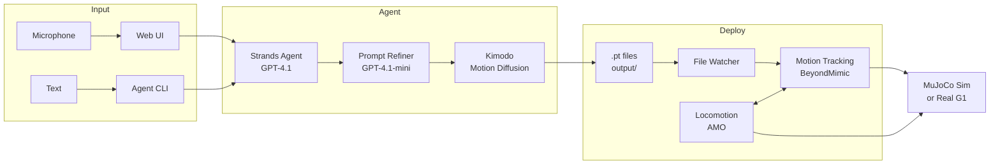

# G1 Voice2Motion

LLM agent that generates Unitree G1 humanoid robot motions from natural language, with a web UI for voice interaction and a deploy pipeline for sim/real robot execution.

## Architecture



## Entry points

| Command | Description |
|---|---|
| `uv run web` | Web UI with voice input, 3D preview, and TTS |
| `uv run agent` | Text CLI for motion generation |
| `uv run deploy` | Robot control loop — watches `output/` and plays motions |

## Setup

Clone repos side by side:

```bash
git clone --recurse-submodules <this-repo> g1-voice2motion
git clone https://github.com/HansZ8/RoboJuDo                      # for deploy
git clone https://github.com/unitreerobotics/unitree_sdk2_python   # for robot TTS
```

Install:

```bash
cd g1-voice2motion
uv sync                    # agent + web UI
uv sync --extra deploy     # + robot deploy pipeline (requires ../RoboJuDo)
uv sync --extra tts        # + robot speaker (requires ../unitree_sdk2_python + CycloneDDS)
```

### Environment

Create a `.env` file:

```
OPENAI_API_KEY=sk-...
KIMODO_URL=https://<ngrok-subdomain>.ngrok-free.app
```

### Kimodo server

Kimodo runs on a remote GPU instance. Access via ngrok URL (set in `.env`) or SSH tunnel:

```bash
ssh -L 8420:localhost:8420 -L 7860:localhost:7860 <remote-host>
```

- `localhost:8420` — Kimodo API
- `localhost:7860` — Kimodo visualizer ([Viser](https://github.com/nerfstudio-project/viser)), SSH tunnel only

### ONNX model (for deploy)

Place the tracker model in `../RoboJuDo/assets/models/g1/protomotions_bm_tracker/`:
- `unified_pipeline.onnx`
- `unified_pipeline.yaml`

## Kimodo API

| Endpoint | Response |
|---|---|
| `POST /generate` | JSON with `qpos` trajectory |
| `POST /generate/csv` | Downloadable CSV file |
| `POST /generate/pt` | Binary ProtoMotions MotionLib `.pt` file |
| `GET /health` | Model status, device info, GPU memory |

All ngrok requests require the header `ngrok-skip-browser-warning: true`.

```bash
curl -X POST http://localhost:8420/generate \
  -H "Content-Type: application/json" \
  -d '{"prompt": "A person walks forward", "duration": 3.0, "diffusion_steps": 50}'
```

| Field | Type | Default | Description |
|---|---|---|---|
| `prompt` | string | *required* | Motion description |
| `duration` | float | 3.0 | Motion length in seconds (0.5–30.0), output at 30 fps |
| `diffusion_steps` | int | 100 | Denoising steps (50 = fast, 100 = quality) |
| `num_samples` | int | 1 | Number of motion variations (1–4) |
| `num_transition_frames` | int | 5 | Blending frames between sequential prompt segments |
| `cfg_type` | string | `"regular"` | Guidance type: `"regular"` (guided) or `"nocfg"` (no guidance) |
| `cfg_weight` | float[] | — | Guidance scale(s) when `cfg_type="regular"` |
| `initial_dof_pos` | float[29] | — | Soft pose guidance on first frame |
| `final_dof_pos` | float[29] | — | Soft pose guidance on last frame |
| `constraints` | array | — | Raw Kimodo constraint dicts (root2d, fullbody, end-effector) |

Each frame has 36 values: root xyz (3), root quaternion wxyz (4), 29 joint angles in radians.

## End-to-end demo

```bash
# Terminal 1: web UI (or use `uv run agent` for text CLI)
uv run web

# Terminal 2: deploy (sim)
uv run deploy --motion-path output/some_motion.pt

# For real robot:
uv run deploy --config g1_agent_locomimic_real --motion-path output/some_motion.pt
```

Speak into the mic in the web UI. The agent generates motions. The deploy pipeline picks them up and plays them on the robot.

## Project structure

```
src/
  main.py                          # agent CLI entry point
  agent/
    agent.py                       # Strands agent, system prompt
    prompt_refiner.py              # GPT-4.1-mini prompt optimization
    tools/
      generate_motion.py           # @tool — calls Kimodo, saves .pt files
  web/
    server.py                      # FastAPI web UI server
    agent_runner.py                # web-specific agent wrapper with TTS
  deploy/
    run.py                         # deploy entry point (tyro CLI)
    agent_tracker_policy.py        # BeyondMimic tracker with blend edges
    configs.py                     # LocoMimic configs (sim + real)
  g1/
    audio/                         # Unitree robot speaker (TTS)
```

## Development

```bash
make          # uv sync + ruff + basedpyright
make lint     # ruff + basedpyright only
```
